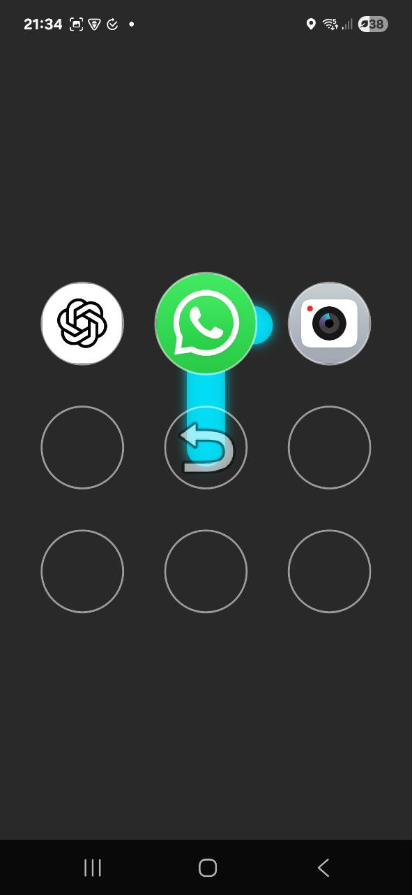

<h1>📱 Pattern Launcher (in work)</h1>

A minimal Android custom launcher that opens apps through a 3×3 pattern pad.
Instead of tapping icons, you draw patterns (like the classic lockscreen) to open apps or folders.

✨ Features (current version)

<ul>
<li>🎨 3×3 pattern pad with dots and connecting lines</li>
<li>🔗 Callback system: each pattern can be mapped to an app or action</li>
<li>🧩 Extensible: supports adding icons, folders, and nested folder structures later</li>
<li>⚡ Launcher integration: can be set as the default home screen</li>
</ul>

